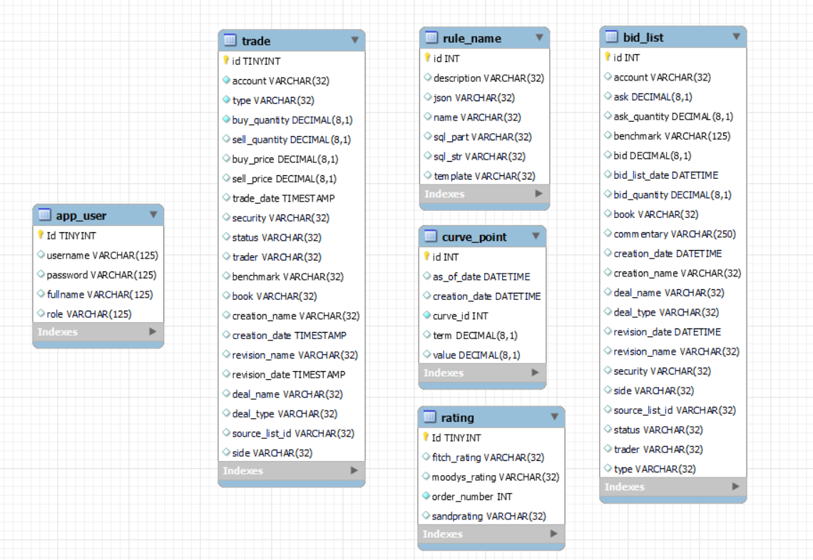
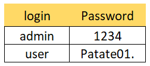

  

## Presentation du projet OC-Poseidon :

### Quels sot les objectifs de ce projet ?
 
Au travers du développement d'une application de gestion d'entités financières, ce projet OpenClassRooms est orienté "sécurité". En effet, il est demandé , en plus de l'implémentation des méthodes CRUD pour les entités financières :
	- d'implémenter l'authentification et la gestion des rôles utilisateurs, 
	- de gérer les logs,
	- de valider les saisies,
	- et bien entendu de tester correctement l'application développée
	 

## En pratique :

### Getting Started

#### Projet Spring boot   
 - Java 17
 - Thymeleaf
 - Spring Security
 - Spring Data JPA
 - Spring Web

Attention, avec Spring boot 3, on doit utiliser Spring Security 6 et jakarta au lieu de javax pour les import de validation et de persistence.

#### Authentification pour accéder à l'application

	Deux méthodes d'authentification sont utilisées.

 #####  `authentification simple` utilisant un login et mot de passe encryptée en base de données, Seul un administrateur peut créer et modifier ces données utilisateurs et attribuer par la même un rôle USER 'simple' ou un rôle ADMIN à l'utilisateur nouvellement créé.

 #####  `authentification OAuth2` : se basant sur la sécurité GitHub pour l'authentification des utilisateurs. Si un utilisateur se connecte par cet intermédiaire alors il n'aura qu'un simple rôle 'USER".

# Modèle physique de données

Pas de relation entre les différentes entités donc pas de relation entre les tables de la base, pas de clés étrangères.

### Running App

Pour pouvoir utiliser l'application, Post installation de MySQL, Java et Maven, il faudra créer la structure de la base de données.
Pour cela, il faut exécuter la requête `data.sql` présente dans le répertoire `resources\static\script`.

A partir de là vous pourrez importer le code dans l'IDE de votre choix et exécuter PoseidonApplication.java pour lancer l'application.
Une fois que le code aura compilé, rendez-vous  dans votre navigateur : [http://localhost:8082](http://localhost:8082)  pour jouer avec l'App !

Voici quelques login and password pour la tester :

sachant que  : 
	- `seul un utilisateur ayant pour role ADMIN peut accéder à les gestion  des utilisateurs` 
et que : 
	- `seul un utilisateur ayant pour role USER peut accéder aux entités financières` 

### Testing

L'application a été testée : tests unitaires et d'intégration sont à disposition.
Pour exécuter les TU depuis Maven, se rendre dans le répertoire contenant le fichier pom.xml et exécuter la commande suivante :

`mvn test`

